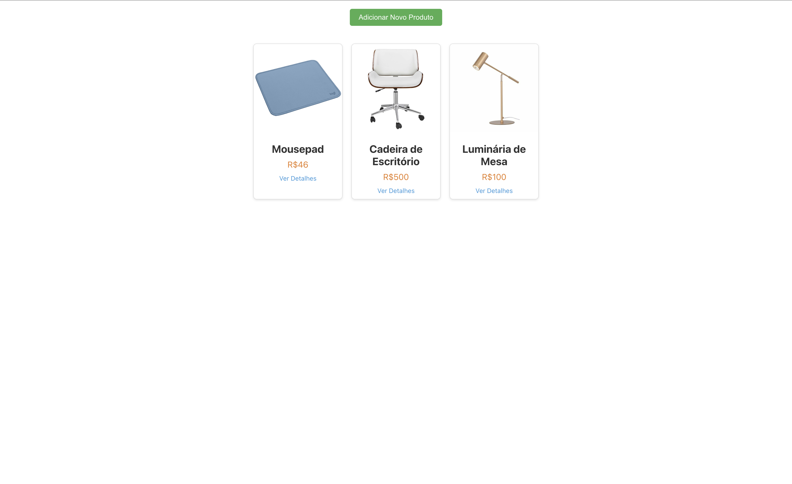
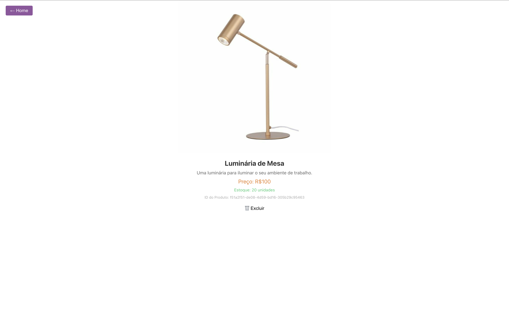
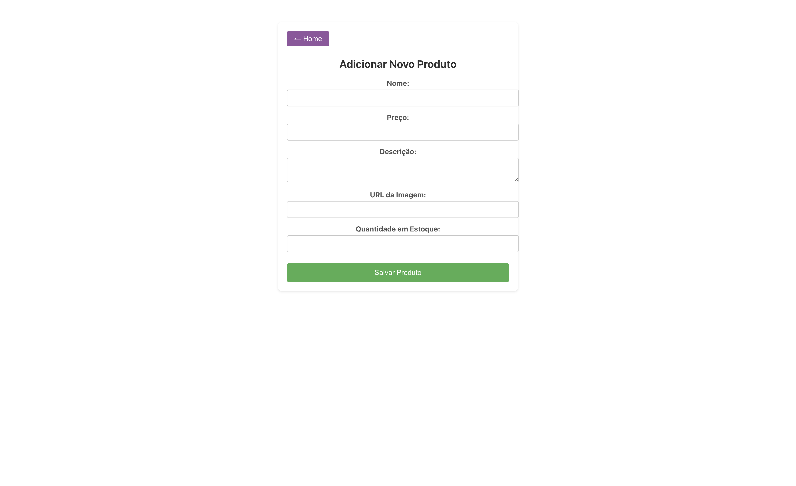

# loja-digport-frontend

## Home page
Composed by our list of products

## Product page
Composed by the product details and the option to delete it

## Add product page
Composed by a form to add a new product

# Setup

## Install Node.js

1. Download and install Node.js from the official website: https://nodejs.org/en/

# Run the project
1. Go to the folder where you are storing the files from DigPort Academy

1. Open a terminal on this folder

1. Clone this repository by running this command on the terminal: `git clone https://github.com/rafack/loja-digport-frontend.git`

1. Run `cd loja-digport-frontend`

1. Run `npm install` to install the project dependencies

1. Run `npm start` to start the project

1. Access the project at http://localhost:3000
